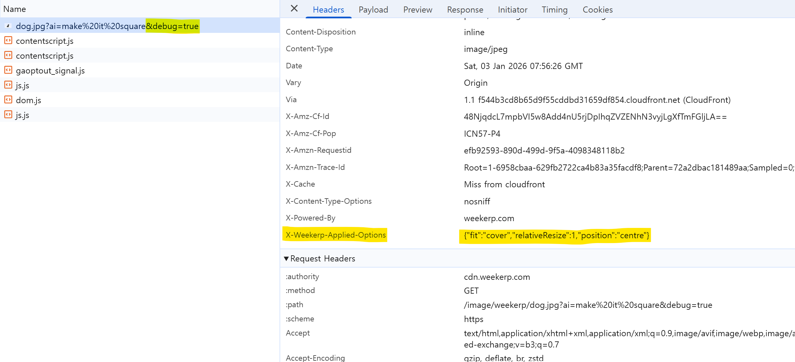

# Debugging

AI Query converts your natural-language prompt into internally executable transformation options.\
In Debugging mode, you can inspect the final applied options in the `x-weekerp-applied-options` response header.

### Mac / Linux (bash, zsh)

```bash
curl -sI --get "<https://cdn.weekerp.com/image/weekerp/dog.jpg>" \\
  --data-urlencode "debug=true" \\
  --data-urlencode "ai=make it square" \\
  | tr -d '\\r' \\
  | awk -F': ' 'tolower($1)=="x-weekerp-applied-options"{print $2}'
```

### Windows CMD

```bash
curl -sI -G "https://cdn.weekerp.com/image/weekerp/dog.jpg" -d "debug=true" --data-urlencode "ai=make it square" | findstr /I "^x-weekerp-applied-options:"
```


#### Example output

```json
x-weekerp-applied-options: {"fit":"cover","position":"centre","relativeResize":1}
```


### Check on the website

You can also verify this by entering a URL on the [demo page.](https://weekerp.com/resource/demo)


### Check in Developer Tools

```
https://cdn.weekerp.com/image/weekerp/dog.jpg?ai=make it square&debug=true
```

When you enable `debug=true`, you can find `x-weekerp-applied-options` in the response headers in your browser’s DevTools.

<figure><figcaption></figcaption></figure>
