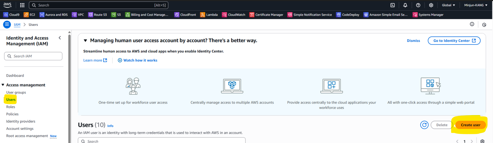

# AWS S3


This guide explains how to connect AWS S3 to use the Weekerp API.

It covers the full process of issuing credentials and registering them in Weekerp.


#### Required information for connecting

To allow Weekerp to access your images, you need to provide the following:

* Access Key ID
* Secret Access Key
* Bucket name


#### Getting credentials

If you’re not familiar with AWS, we recommend creating a dedicated IAM user so Weekerp can access your images.


1. Open the Amazon IAM (Identity and Access Management) console.
2. Go to **Users ⟶ Create user**.
3. Make sure to enable **Programmatic access**.
4. In the **Permissions** step, select **Attach existing policies directly**.
5. Search for and select the **AmazonS3ReadOnlyAccess** policy.
6. After completing the steps, you’ll receive an **Access Key** and **Secret Access Key**.
7. Then log in to Weekerp.
8. Go to **Sources ⟶ Add Source ⟶ Amazon S3**.
9. Enter the credentials you obtained above.


#### Below is the same guide shown in images.

#### 1. In the AWS Management Console, search for **IAM**

<figure><figcaption></figcaption></figure>


#### 2.  In the left navigation, click **Users**, then click **Create user**

1. Click **Users** in the left navigation
2. Click **Create user** (bottom-right)

<div data-full-width="true"><figure><figcaption></figcaption></figure></div>


#### 3. Enter a user name and click **Next**

1. Enter `weekerp-cdn-reader`
2. Click **Next**

<figure><figcaption></figcaption></figure>


#### 4. Attach a policy

1. Search for **AmazonS3ReadOnlyAccess**
2. Select it from the results
3. Click **Next**

<figure><figcaption></figcaption></figure>


> If you prefer attaching a custom policy directly, you’ll need permissions like the following:

```json
{
  "Statement": [
    {
      "Effect": "Allow",
      "Action": [
        "s3:GetObject",
        "s3:ListBucket",
        "s3:GetBucketLocation"
      ],
      "Resource": [
        "arn:aws:s3:::my-bucket/*",
        "arn:aws:s3:::my-bucket"
      ]
    }
  ]
}
```


#### 5. Verify the creation result

1. Confirm the created user
2. Click **View user**

<figure><figcaption></figcaption></figure>


#### 6. On the user details page, open the **Security credentials** tab

<figure><figcaption></figcaption></figure>

ㅡ

#### 7.  Scroll down and click **Create access key**

1. Scroll down
2. Click **Create access key**

<figure><figcaption></figcaption></figure>


#### 8. Add a description and create the key

1. Enter a **Description tag value**
2. Click **Create access key**

<figure><figcaption></figcaption></figure>


#### 9. Confirm the result and download the CSV file

1. Verify the keys
2. (Recommended) Download the **CSV file**

<figure><figcaption></figcaption></figure>

&#x20;

#### 10. Make sure you have the following ready:

1. Bucket Region (Step #1)
2. Access Key ID (Step #9)
3. Secret Access Key (Step #9)
4. Bucket Name (Step #4)


#### 11. In Weekerp, click **Add Source** (top-right)

1. [Open Weekerp](https://weekerp.com/space/callback)
2. Click the **Source** tab
3. Click **Add Source**

<figure><figcaption></figcaption></figure>


#### 12. Select **Amazon S3**

<figure><figcaption></figcaption></figure>


#### 13. Enter credential information

1. Select **Region**
2. Enter **Access Key ID**
3. Enter **Secret Access Key**
4. Enter **Bucket Name**

<figure><figcaption></figcaption></figure>



**BasePath** sets the root directory for origin requests.


If your files are stored like below, you can set BasePath to `/` or `/assets`.

* /dog.jpg
* /assets/cat.png


**Request example**

* `cdn.weekerp.com/image/{alias}/dog.jpg`

**Origin request**

* **With BasePath set:** https://static.example.com/**`assets`**/dog.jpg
* **Without BasePath:** https://static.example.com/dog.jpg

For more details, please refer to [basepath.md](../basepath.md "mention").


#### 14. Enter the source alias

1. Enter the alias you want to use
2. Create the alias

<figure><figcaption></figcaption></figure>


#### 15. Verify the created data source

<figure><figcaption></figcaption></figure>


#### Use it like this:

cdn.weekerp.com/<mark style="color:red;">`image`</mark>/`weekerp-assets`/dog.jpg

cdn.weekerp.com/<mark style="color:red;">`image`</mark>/`weekerp-assets`/dog.jpg?ai=Rotate the image to the right

cdn.weekerp.com/<mark style="color:red;">`video`</mark>/`weekerp-assets`/test-video.mp4


All settings are complete.

In general, it takes about **5–10 minutes** to propagate the connection across all global environments.


