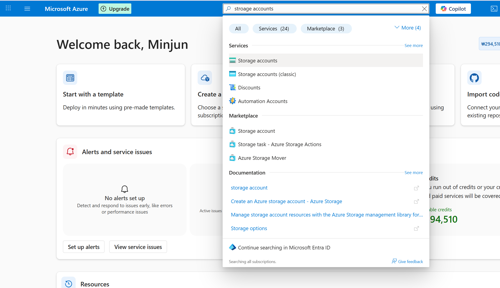
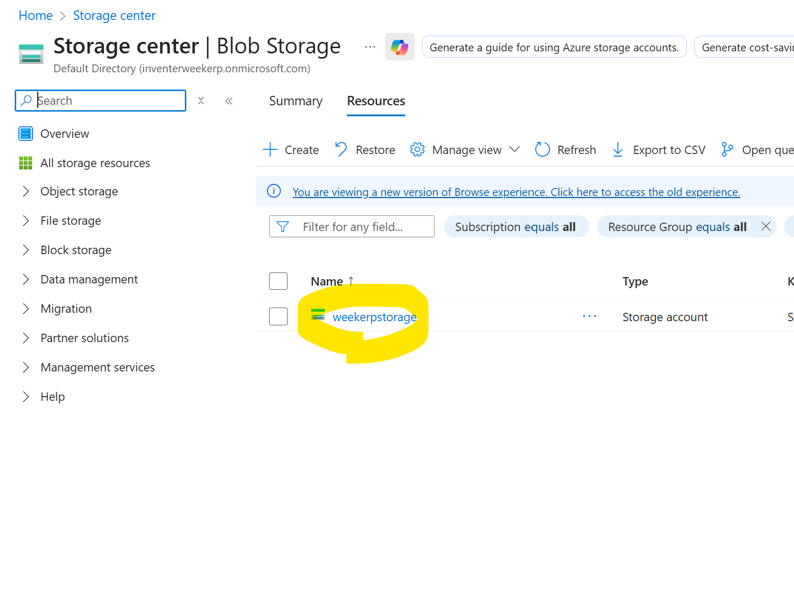
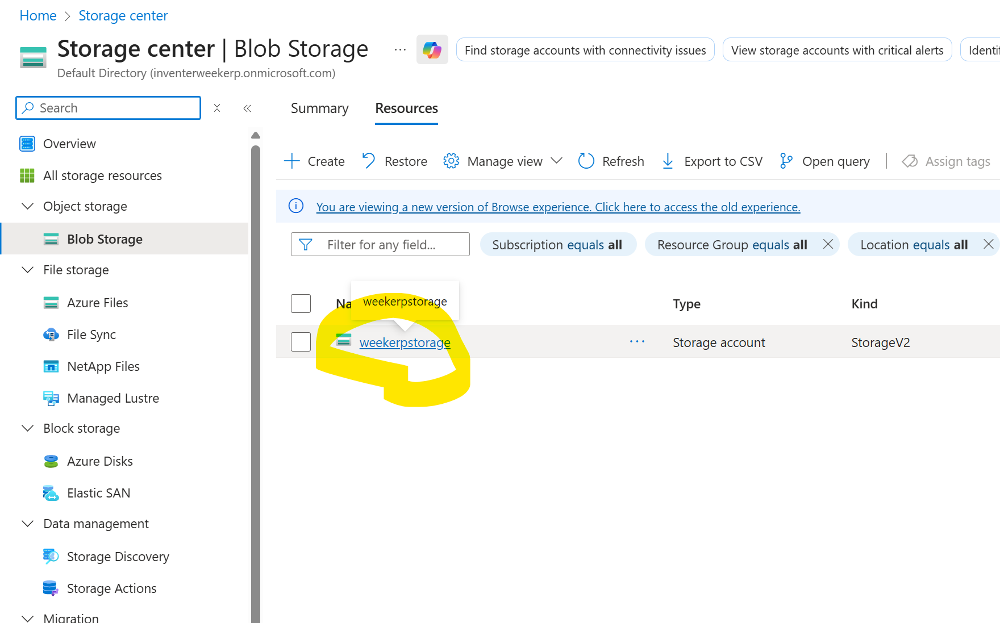
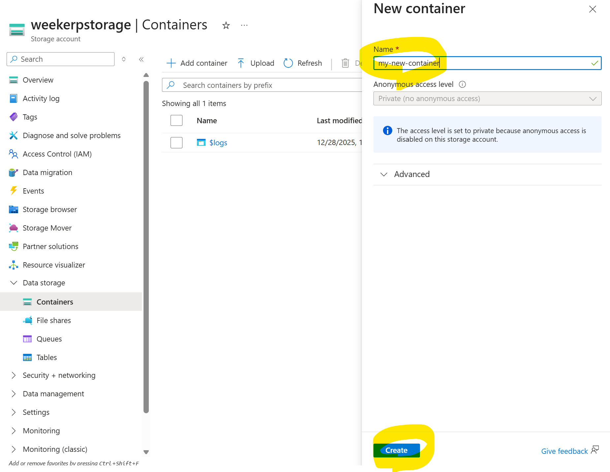
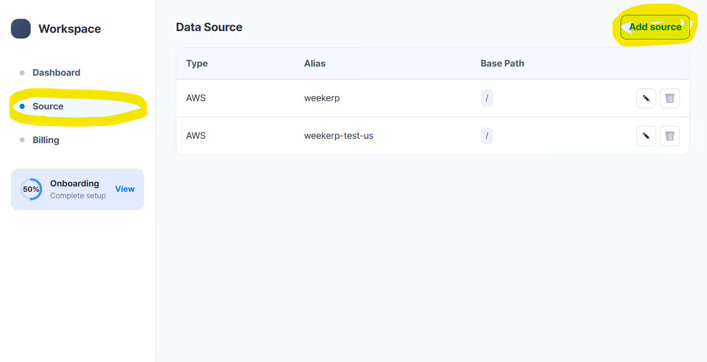

# Azure Blob

This guide explains how to connect **Azure Storage** to the Weekerp API.

It includes the full process of creating credentials and registering them in Weekerp.


#### Required information for connection

To allow Weekerp to access your images, you need to provide the following:

* account key
* account name
* container name


#### Getting credentials (Azure)

1. Go to Azure Portal → **Storage accounts → Create** (create a Storage account)
2. Select the created Storage account **→ Security + networking → Access keys → key1 → Copy** (Account Key)
3. Select the created Storage account → **Data storage → Containers → Add container → Create** (Container Name)
4. Log in to Weekerp → **Sources → Add Source → Microsoft Azure Storage**
5. Enter Account Name / **Account Key / Container Name** in Weekerp → **Next → Enter Alias → Create**


#### Below is the same guide shown as step-by-step screenshots.


#### 1. In Azure Portal, search for “Storage accounts”

<figure><figcaption></figcaption></figure>


#### 2. Click “Create”

<figure><figcaption></figcaption></figure>


#### 3. Create a Storage account

1. Enter the account name
2. Click “Review + create” at the bottom

<figure><figcaption></figcaption></figure>


#### 4. Click “Create” at the bottom

<figure><figcaption></figcaption></figure>


#### 5. Issue an access key — search and open Storage accounts

1. Search for “Storage accounts”
2. Click the Storage accounts search result

<figure><figcaption></figcaption></figure>


#### 6. Click the Storage account you created

<figure><figcaption></figcaption></figure>


#### 7. Open Access keys

1. In the left navigation, click “Security + networking”
2. Click “Access keys”

<figure><figcaption></figcaption></figure>


#### 8. View the Access Key

1. Locate “key1”
2. Click the “Show” button

<figure><figcaption></figcaption></figure>


#### 9. Copy the Access Key

1. Confirm the key value
2. Copy it to clipboard

<figure><figcaption></figcaption></figure>


#### 10. Verify the key format

A copied key looks like this:

```
mu1L4j9LQL4uwoai20+fFD6dE6Z0JCU0KYmgpooyuEDz/1GJWwirCzrokVXjCqRBeFuoIPXsBgTH+AStC6O0qw==
```


#### 11. Create storage container — search for “Storage accounts” in Azure Portal

<figure><figcaption></figcaption></figure>


#### 12. Select the Storage account

<figure><figcaption></figcaption></figure>


#### 13. Open Containers

1. In the left navigation, click “Data storage”
2. Click “Containers”

<figure><figcaption></figcaption></figure>


#### 14. Click “Add container”

<figure><figcaption></figcaption></figure>


#### 15. Enter the container name and create it

1. Enter the container name
2. Click “Create” at the bottom

<figure><figcaption></figcaption></figure>


#### 16. Verify the container name — search for “Storage accounts” in Azure Portal

<figure><figcaption></figcaption></figure>


#### 17. Click the Storage Account you want to connect

<figure><figcaption></figcaption></figure>


#### 18. Open Containers

1. In the left navigation, click “Data storage”
2. Click “Containers”

<figure><figcaption></figcaption></figure>


#### 19. Confirm the target container name

<figure><figcaption></figcaption></figure>


#### 20. You should have the following information ready

1. Account Name (Step #6, Step #17)
2. Account Key : (Step #9)
3. Container Name (Step #19)


#### 21. In Weekerp, click “Add Source” at the top-right

1. [Log in to Weekerp](https://weekerp.com/space/callback)
2. Click the “Source” tab
3. Click “Add Source”

<figure><figcaption></figcaption></figure>


#### 22. Select “Microsoft Azure Storage”

<figure><figcaption></figcaption></figure>


#### 23. Enter credential information

1. Enter Account Name
2. Enter Account Key
3. Enter Container Name
4. Click “Next”

<figure><figcaption></figcaption></figure>



BasePath sets the root directory for origin requests.


If files are stored like below, BasePath can be set to `/` or `/assets`.

* /dog.jpg
* /assets/cat.png


**Request example**

* `cdn.weekerp.com/image/{alias}/dog.jpg`

**Origin request**

* **With BasePath set:** https://static.example.com/**`assets`**/dog.jpg
* **Without BasePath:** https://static.example.com/dog.jpg

For more details, please refer to [basepath.md](../basepath.md "mention").


#### 24. Enter the source alias (alias)

1. Enter the alias you want to use
2. Create the alias

<figure><figcaption></figcaption></figure>


#### 25. Verify the created data source

<figure><figcaption></figcaption></figure>


#### Use it like this:

cdn.weekerp.com/<mark style="color:red;">`image`</mark>/`weekerp-assets`/dog.jpg

cdn.weekerp.com/<mark style="color:red;">`image`</mark>/`weekerp-assets`/dog.jpg?ai=Rotate the image to the right

cdn.weekerp.com/<mark style="color:red;">`video`</mark>/`weekerp-assets`/test-video.mp4


All settings are complete.

Typically, it takes 5–10 minutes to propagate the connection across all global environments.
