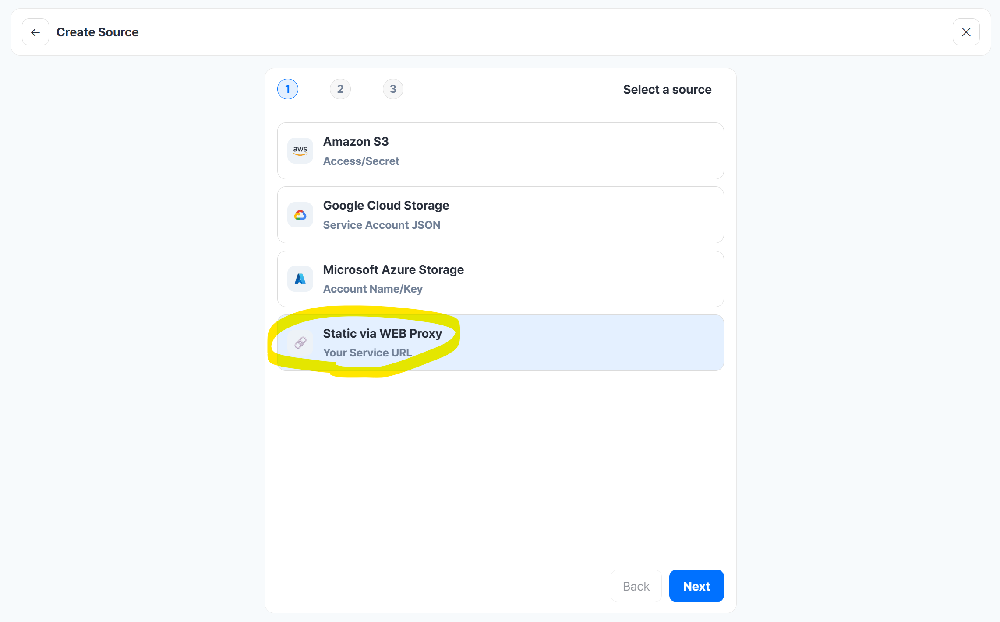
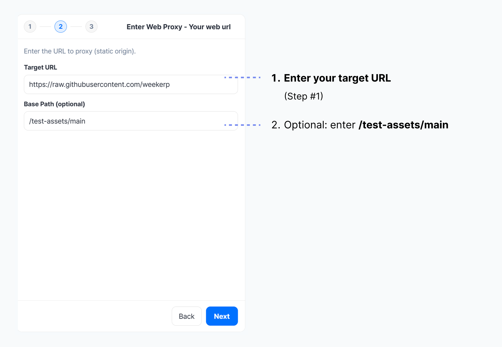

# Web Proxy

This guide explains how to connect using the WEB Proxy method via the Weekerp API.

Connect images uploaded on the web to Weekerp.

#### Required information for connection

To allow Weekerp to access your images, you need to provide the following:

* Target URL

#### 1. Understanding Web Proxy

1.  Users request images through the Weekerp CDN URL.

    ex) `https://cdn.weekerp.com/image/{alias}/dog.jpg`
2.  Weekerp fetches the image from the **Target URL (origin server)** connected to `{alias}`.

    ex) `https://raw.githubusercontent.com/weekerp/test-assets/main` + `/dog.jpg`
3.  The origin server returns the image file.

    ex) `https://raw.githubusercontent.com/weekerp/test-assets/main/dog.jpg`
4. Weekerp processes the response, delivers it to users, and caches it for 1 year.
5. After that, the same request is served quickly from cache without calling the origin.


WEB PROXY can be connected using only a “publicly accessible URL,” **without bucket/key.**


If the origin server requires credentials, you can add authentication headers (e.g., `Authorization`) via Custom Headers.

Custom Headers cannot currently be configured directly in the Weekerp console. However, the capability is available internally—if you need it, please contact us via ([inquiry link](https://accounts.weekerp.com/support?redirect_uri=https%3A%2F%2Fweekerp.com\&lang=en)).

#### 2. Connection example (Target server: GitHub Repo)

* Upload images and videos to a GitHub repository.
* GitHub resources can be accessed via URL.

#### 3. Repository information

The image repository on GitHub is as follows:

`https://raw.githubusercontent.com/weekerp/test-assets/main`



#### 4. Example stored files

There are 4 files under this path.

<figure><figcaption></figcaption></figure>

#### 5. Public image requirements

The image must be publicly accessible like this:

[https://raw.githubusercontent.com/weekerp/test-assets/main/dog.jpg](https://raw.githubusercontent.com/weekerp/test-assets/main/dog.jpg)

#### 6. You must have the following ready

1. Target Url (Step #5)

#### 7. After logging into Weekerp, click “Add Source” at the top-right

1. [Log in to Weekerp](https://weekerp.com/space/callback)
2. Click the “Source” tab
3. Click “Add Source”

<figure><figcaption></figcaption></figure>

#### 8. Select “Static via WEB Proxy”

<figure><figcaption></figcaption></figure>

#### 9. Enter connection information

1. Enter the Target URL
2. (If needed) Set Base Path

<figure><figcaption></figcaption></figure>


BasePath sets the root directory for origin requests.


If files are stored like below, BasePath can be set to `/` or `/assets`.

* /dog.jpg
* /assets/cat.png

**Request example**

* `cdn.weekerp.com/image/{alias}/dog.jpg`

**Origin request**

* **With BasePath set:** https://static.example.com/**`assets`**/dog.jpg
* **Without BasePath:** https://static.example.com/dog.jpg

For more details, please refer to [basepath.md](../basepath.md "mention").

#### 10. Enter the source alias (alias)

1. Enter the alias you want to use
2. Create the alias

<figure><figcaption></figcaption></figure>

#### 11. Verify the created data source

<figure><figcaption></figcaption></figure>

#### Use it like this:

cdn.weekerp.com/<mark style="color:red;">`image`</mark>/`weekerp-assets`/dog.jpg

cdn.weekerp.com/<mark style="color:red;">`image`</mark>/`weekerp-assets`/dog.jpg?ai=Rotate the image to the right

cdn.weekerp.com/<mark style="color:red;">`video`</mark>/`weekerp-assets`/test-video.mp4

All settings are complete.

Typically, it takes 5–10 minutes to propagate the connection across all global environments.
