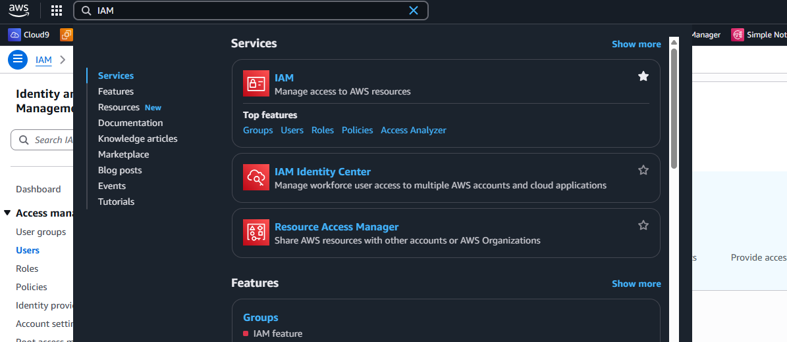

# AWS S3

위커프 CDN과 S3를 연결하는 과정에 대한 가이드에요.

IAM 계정을 발급하고 위커프에 등록하는 과정이에요.

ㅊ

#### 1. AWS 관리 콘솔, IAM 검색

<figure><figcaption></figcaption></figure>

#### 2.  좌측  네비게이션바 User 탭 클릭 후 Create User 클릭

1. 좌측 네비게이션 바 User 탭 클릭
2. 우측 하단 Create user 클릭

<figure><figcaption></figcaption></figure>

#### 3. user name 입력 후 다음버튼 클릭

1. weekerp-cdn-reader 입력
2. 다음버튼 클릭

<figure><figcaption></figcaption></figure>

#### 4. 정책연결

1. `AmazonS3ReadOnlyAccess` 검색
2. 검색 결과 클릭
3. 다음 버튼 클릭

<figure><figcaption></figcaption></figure>

생성결과 확인

1. 생성결과 확인
2. View User 클릭

<figure><figcaption></figcaption></figure>

유저 상세화면 중 Security Credentials 탭 클릭

<figure><figcaption></figcaption></figure>

ㅡ

스크롤 후 하단 Create access Key 클릭

<figure><figcaption></figcaption></figure>

Description 추가 후 키 생성

<figure><figcaption></figcaption></figure>

결과 확인 및 CSV 파일 다운로드

<figure><figcaption></figcaption></figure>

&#x20;

위커프 접속 후 source 탭, 우측 상단 Add Source 클릭

1. [위커프 접속](https://weekerp.com/space/callback)
2. Source 탭 클릭 후
3. Add Source 클릭

<figure><figcaption></figcaption></figure>

각 정보 입력

<figure><figcaption></figcaption></figure>

고유의 식별자 입력 (weekerp-assets)

<figure><figcaption></figcaption></figure>


고유의 식별자를 통해 CDN을 이용할 수 있습니다.

https://cdn.weekerp.com/image/**`{unique-identifier}`**/dog.jpg?s=200x200


생성된 CDN 확인

<figure><figcaption></figcaption></figure>

일반적으로 모든 글로벌 환경에 연결을 전파하는데 까지는 5\~10 분 소요됩니다.

