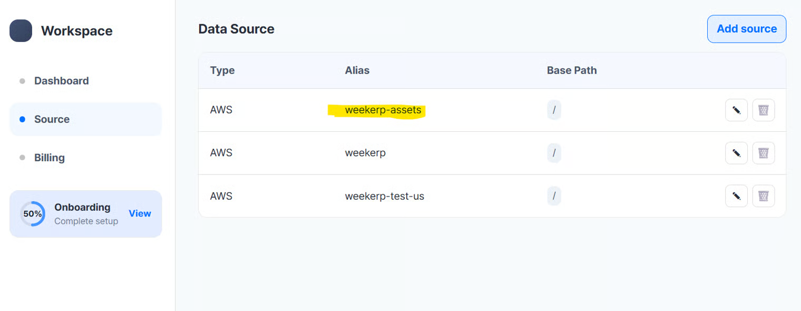

# AWS S3

위커프 API를 이용하기 위해 AWS S3에 연결하는 방법을 안내합니다.

자격 증명을 발급하고 발급받은 자격 증명을 위커프에 등록하는 전체 과정을 포함합니다.


#### 연결에 필요한 정보

위커프가 이미지에 접근할 수 있도록 하기 위해 다음 정보를 입력해야 합니다:

* Access Key ID
* Secret Access Key
* Bucket 이름


#### 자격 증명 얻기

AWS에 익숙하지 않다면, Weekerp 에서 이미지를 접근할 수 있도록&#x20;

**전용 IAM 사용자**를 새로 만드는 것을 추천합니다.


1. **Amazon IAM (Identity and Access Management)** 콘솔을 엽니다.
2. **Users ⟶ Create user** 로 이동합니다.
3. “Programmatic access(프로그래밍 방식 접근)” 옵션을 반드시 활성화합니다.
4. **Permissions(권한)** 탭에서 “Attach existing policies directly(기존 정책 직접 연결)”을 선택합니다.
5. “AmazonS3ReadOnlyAccess”라는 정책을 검색하고 선택합니다.
6. 절차를 완료하면 필요한 Access Key와 Secret Key를 받을 수 있습니다.
7. 이후 [**Weekerp 로그인**](https://weekerp.com/space/callback)
8. **Sources ⟶ Add Source ⟶ Amazon S3** 로 이동합니다.
9. 위에서 얻은 자격 증명 정보를 입력하면 됩니다.


#### 아래는 이미지로 나타낸 가이드 문서입니다.

#### 1. AWS 관리 콘솔, IAM 검색

<figure><figcaption></figcaption></figure>


#### 2.  좌측  네비게이션바 User 탭 클릭 후 Create User 클릭

1. 좌측 네비게이션 바 User 탭 클릭
2. 우측 하단 Create user 클릭

<div data-full-width="true"><figure><figcaption></figcaption></figure></div>


#### 3. user name 입력 후 다음버튼 클릭

1. weekerp-cdn-reader 입력
2. 다음버튼 클릭

<figure><figcaption></figcaption></figure>


#### 4. 정책연결

1. `AmazonS3ReadOnlyAccess` 검색
2. 검색 결과 클릭
3. 다음 버튼 클릭

<figure><figcaption></figcaption></figure>


> 직접 정책을 연결하고 싶은경우 아래와 같은 권한이 필요합니다.

```json
{
  "Statement": [
    {
      "Effect": "Allow",
      "Action": [
        "s3:GetObject",
        "s3:ListBucket",
        "s3:GetBucketLocation"
      ],
      "Resource": [
        "arn:aws:s3:::my-bucket/*",
        "arn:aws:s3:::my-bucket"
      ]
    }
  ]
}
```


#### 5. 생성결과 확인

1. 생성결과 확인
2. View User 클릭

<figure><figcaption></figcaption></figure>


#### 6. 유저 상세화면 중 Security Credentials 탭 클릭

<figure><figcaption></figcaption></figure>

ㅡ

#### 7. 스크롤 후 하단 Create access Key 클릭

1. 아래로 스크롤
2. Create Access Key 클릭릭

<figure><figcaption></figcaption></figure>


#### 8. Description 추가 후 키 생성

1. Description tag value 입력
2. Create Access Key 클릭릭

<figure><figcaption></figcaption></figure>


#### 9. 결과 확인 및 CSV 파일 다운로드

1. 키 확인
2. (권장) CSV 파일 다운로드드

<figure><figcaption></figcaption></figure>

&#x20;

#### 10. 다음과 같은 정보가 준비되어 있어야 합니다.

1. Bucket Region (Step #1)
2. Access Key ID (Step #9)
3. Secret Access Key (Step #9)
4. Bucket Name (Step #4)


#### 11. 위커프 접속 후 우측 상단 Add Source 클릭

1. [위커프 접속](https://weekerp.com/space/callback)
2. Source 탭 클릭 후
3. Add Source 클릭

<figure><figcaption></figcaption></figure>


#### 12. Amazon S3 선택

<figure><figcaption></figcaption></figure>


#### 13. 자격증명 정보 입력

1. Region 선택
2. Access Key ID 입력
3. Secret Access Key 입력
4. Bucket Name 입력

<figure><figcaption></figcaption></figure>



BasePath는 원본 요청의 루트 디렉터리를 설정합니다.


파일을 아래와 같이 보관하고 있는 경우 basePath는 / 혹은 /assets 으로 설정할 수 있습니다.

* /dog.jpg
* /assets/cat.png


**요청 예시**

* `cdn.weekerp.com/image/{alias}/dog.jpg`

**원본 요청**

* BasePath 설정 : https://static.example.com/**`assets`**/dog.jpg
* BasePath 미 설정 : https://static.example.com/dog.jpg

자세한 사안은 [basepath.md](../basepath.md "mention")을 참고해주세요.


#### 14. 소스 별칭(alias) 입력

1. 사용할 별칭 입력
2. 별칭을 생성

<figure><figcaption></figcaption></figure>


#### 15. 생성된 데이터 소스 확인

<figure><figcaption></figcaption></figure>


#### 다음과 같이 사용하세요.

cdn.weekerp.com/<mark style="color:red;">`image`</mark>/`weekerp-assets`/dog.jpg

cdn.weekerp.com/<mark style="color:red;">`image`</mark>/`weekerp-assets`/dog.jpg?ai=Rotate the image to the right

cdn.weekerp.com/<mark style="color:red;">`video`</mark>/`weekerp-assets`/test-video.mp4


모든 설정을 완료했습니다.

일반적으로 모든 글로벌 환경에 연결을 전파하는데 까지는 5\~10 분 소요됩니다.


