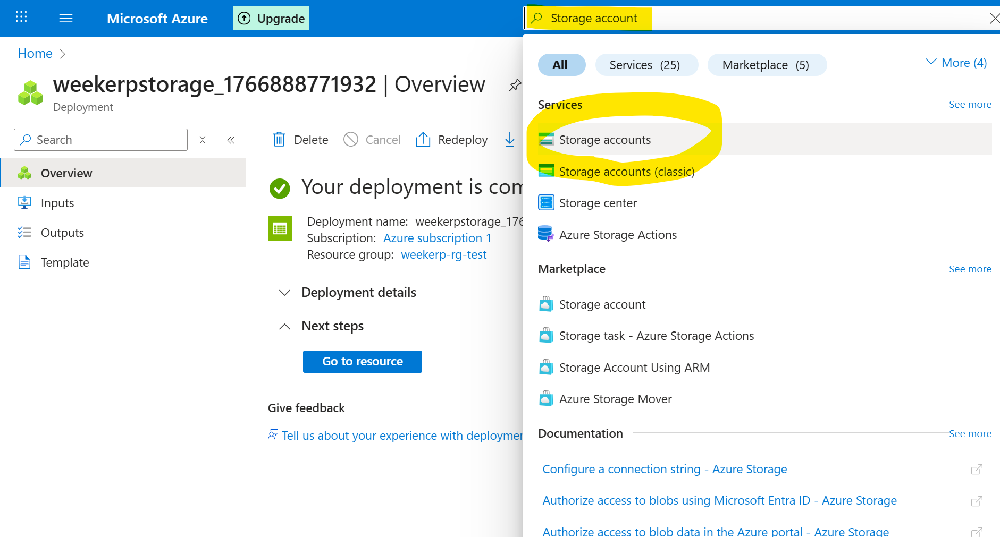
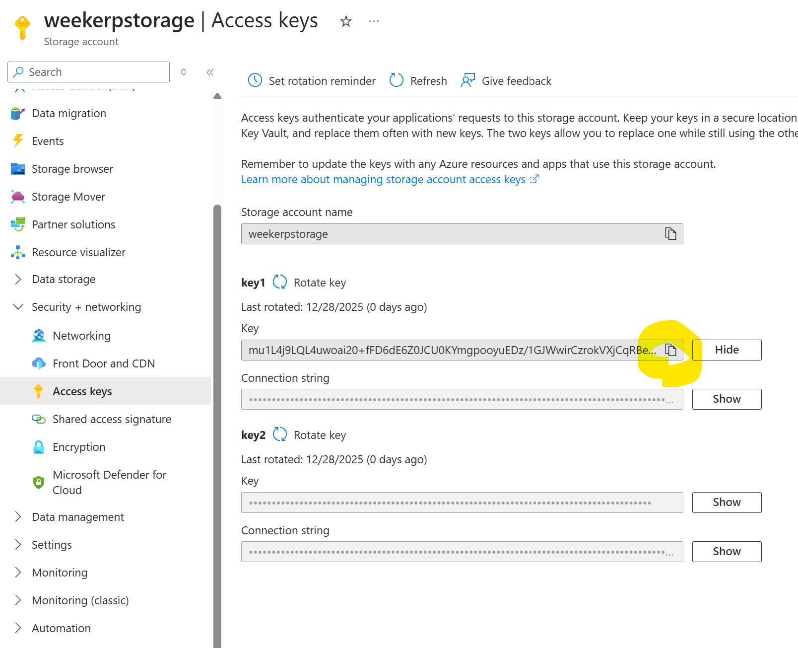
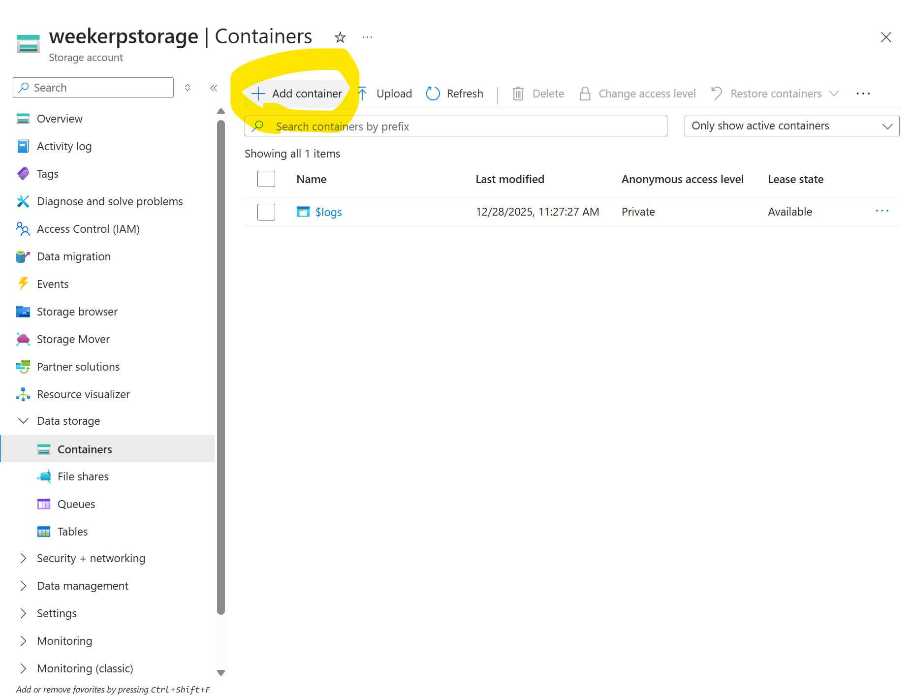
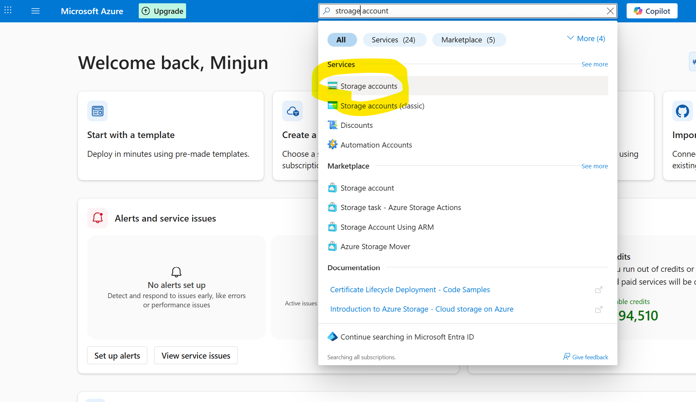
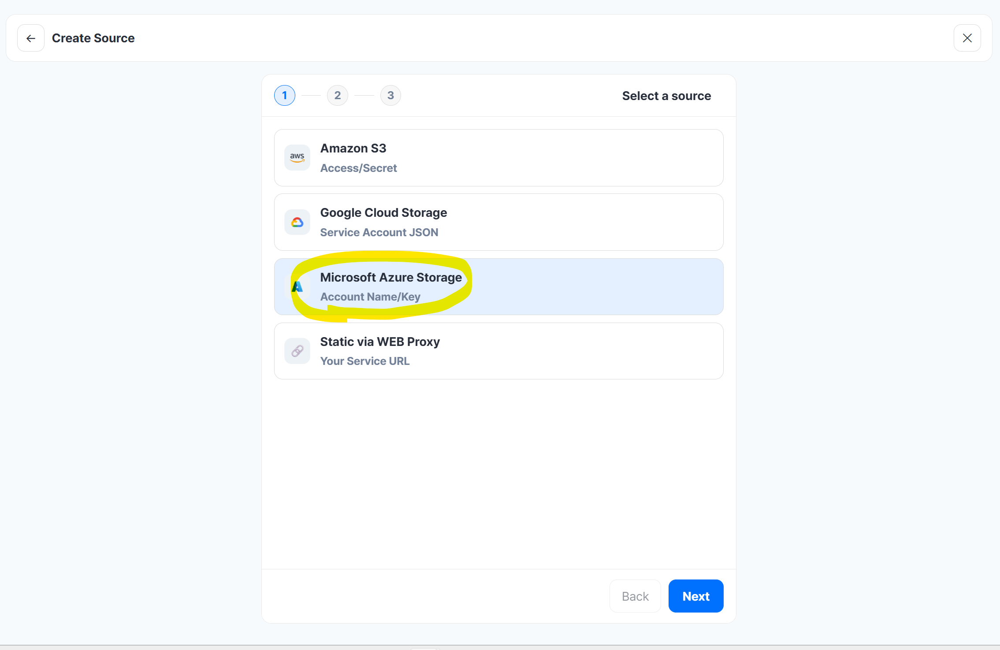
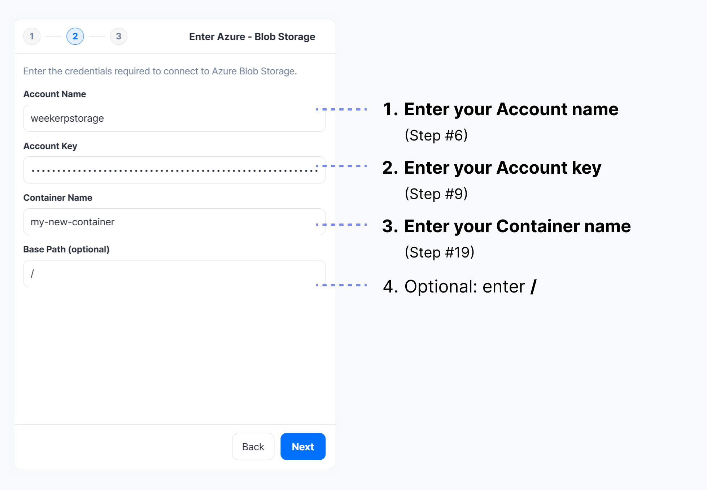

# Azure Blob

위커프 API를 이용하기 위해 Azure의 스토리지에 연결하는 방법을 안내합니다.&#x20;

자격 증명을 발급하고 발급받은 자격 증명을 위커프에 등록하는 전체 과정을 포함합니다.


#### 연결에 필요한 정보

위커프가 이미지에 접근할 수 있도록 하기 위해 다음 정보를 입력해야 합니다:

* account key
* account name
* container name


#### 자격증명 얻기 (Azure)

1. Azure 관리 콘솔 접속 → **Storage accounts → Create** (Storage account 생성)
2. 생성한 Storage account 선택 → **Security + networking → Access keys → key1 → Copy** (Account Key)
3. 생성한 Storage account 선택 → **Data storage → Containers → Add container → Create** (Container Name)
4. Weekerp 접속 → **Sources → Add Source → Microsoft Azure Storage**
5. Weekerp에 **Account Name / Account Key / Container Name** 입력 → **Next** → **Alias 입력 후 생성**


#### 아래는 이미지로 나타낸 가이드 문서입니다.

#### 1. Azure 관리 콘솔에서 “Storage accounts” 검색

<figure><figcaption></figcaption></figure>


#### 2. “Create” 클릭

<figure><figcaption></figcaption></figure>


#### 3. Storage account 생성

1. account name 입력
2. 하단 Review + create 클릭

<figure><figcaption></figcaption></figure>


#### 4. 하단 Create 클릭

<figure><figcaption></figcaption></figure>


#### 5. 키 발급 - Storage accounts 검색 후 클릭

1. Stroage accounts 검색
2. Stroage accounts 검색결과 클릭

<figure><figcaption></figcaption></figure>


#### 6. 생성된 Storage account 클릭

<figure><figcaption></figcaption></figure>


#### 7. Access Key 클릭

1. 좌측 네비게이션 Security + networking 클릭
2. Access Keys 클릭

<figure><figcaption></figcaption></figure>


#### 8. Access Key 확인

1. key 1 확인
2. show 버튼 클릭

<figure><figcaption></figcaption></figure>


#### 9. Access Key 복사

1. key 확인
2. 클립보드로 복사

<figure><figcaption></figcaption></figure>


#### 10. 키 확인

복사한 키는 다음과 같이 발급됩니다.

```
mu1L4j9LQL4uwoai20+fFD6dE6Z0JCU0KYmgpooyuEDz/1GJWwirCzrokVXjCqRBeFuoIPXsBgTH+AStC6O0qw==
```

#### 11. Stroage 생성 - Azure 관리 콘솔에서 “Stroage accounts” 검색

<figure><figcaption></figcaption></figure>


#### 12. Storage account 선택

<figure><figcaption></figcaption></figure>


#### 13. Containers 클릭

1. 좌측 네비게이션 Data Storage 클릭
2. Containers 클릭

<figure><figcaption></figcaption></figure>


#### 14. Add container 클릭

<figure><figcaption></figcaption></figure>


#### 15. 스토리지 명칭 입력 및 생성

1. 스토리지 명칭 입력
2. 하단 create 클릭

<figure><figcaption></figcaption></figure>


#### 16. Stroage 명칭 확인 - Azure 관리 콘솔에서 “Stroage accounts” 검색

<figure><figcaption></figcaption></figure>


#### 17. 연결하고자 하는 “Storage Account” 클릭

<figure><figcaption></figcaption></figure>


#### 18. Container 클릭

1. 좌측 네비게이션 Data Storage 클릭
2. Containers 클릭

<figure><figcaption></figcaption></figure>


#### 19. 연결하고자 하는 Container 명칭 확인

<figure><figcaption></figcaption></figure>


#### 20. 다음과 같은 정보가 준비되어 있어야 합니다.

1. Account Name (Step #6, Step #17)
2. Account Key : (Step #9)
3. Container Name (Step #19)


#### 21. 위커프 접속 후 우측 상단 Add Source 클릭

1. 위커프 접속
2. Source 탭 클릭 후
3. Add Source 클릭

<figure><figcaption></figcaption></figure>


#### 22. Microsoft Azure Stroage 선택

<figure><figcaption></figcaption></figure>


#### 23. 자격증명 정보 입력

1. Account Name 입력
2. Account Key 입력
3. Container Name 입력
4. Next 버튼 클릭

<figure><figcaption></figcaption></figure>



BasePath는 원본 요청의 루트 디렉터리를 설정합니다.


파일을 아래와 같이 보관하고 있는 경우 basePath는 / 혹은 /assets 으로 설정할 수 있습니다.

* /dog.jpg
* /assets/cat.png


**요청 예시**

* `cdn.weekerp.com/image/{alias}/dog.jpg`

**원본 요청**

* BasePath 설정 : https://static.example.com/**`assets`**/dog.jpg
* BasePath 미 설정 : https://static.example.com/dog.jpg

자세한 사안은 [basepath.md](../basepath.md "mention")을 참고해주세요.


#### 24. 소스 별칭(alias) 입력

1. 사용할 별칭 입력
2. 별칭을 생성

<figure><figcaption></figcaption></figure>


#### 25. 생성된 데이터 소스 확인

<figure><figcaption></figcaption></figure>


#### 다음과 같이 사용하세요.

cdn.weekerp.com/<mark style="color:red;">`image`</mark>/`weekerp-assets`/dog.jpg

cdn.weekerp.com/<mark style="color:red;">`image`</mark>/`weekerp-assets`/dog.jpg?ai=Rotate the image to the right

cdn.weekerp.com/<mark style="color:red;">`video`</mark>/`weekerp-assets`/test-video.mp4


모든 설정을 완료했습니다.

일반적으로 모든 글로벌 환경에 연결을 전파하는데 까지는 5\~10 분 소요됩니다.
